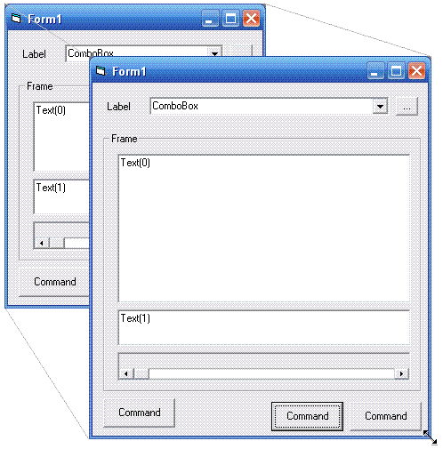



## Layout Manager \(VB\.Net  Style\)

### Description

A very simple lib to automatic resize controls in forms/containers using anchor .net style based on design positions.
 
### More Info
 
Insert any Control/UserControl in LayoutManager when form loads. Eg:

layoutManger.insert Button1, apRight Or apBottom

After, call "resize" method on form_resize event.

Enjoy!

             |
---                |---
**Submitted On**   |2005-12-22 18:40:04
**By**             |[Poorlyte](https://github.com/Planet-Source-Code/PSCIndex/blob/master/ByAuthor/poorlyte.md)
**Level**          |Beginner
**User Rating**    |4.8 (24 globes from 5 users)
**Compatibility**  |VB 6\.0
**Category**       |[Libraries](https://github.com/Planet-Source-Code/PSCIndex/blob/master/ByCategory/libraries__1-49.md)
**World**          |[Visual Basic](https://github.com/Planet-Source-Code/PSCIndex/blob/master/ByWorld/visual-basic.md)
**Archive File**   |[Layout\_Man19590712222005\.zip](https://github.com/Planet-Source-Code/poorlyte-layout-manager-vb-net-style__1-63764/archive/master.zip)

